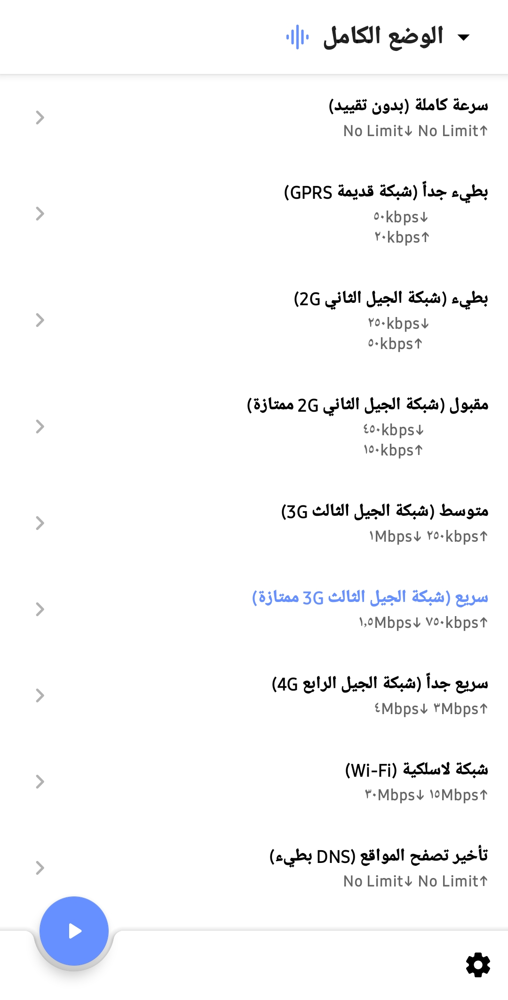
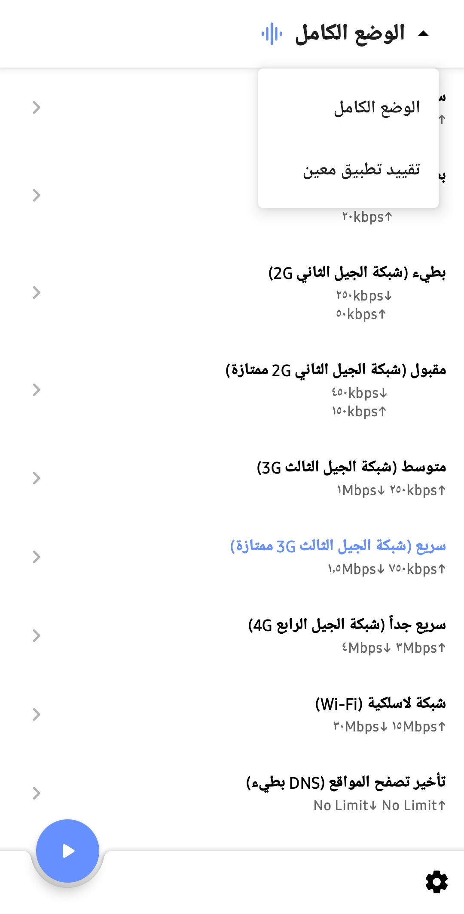
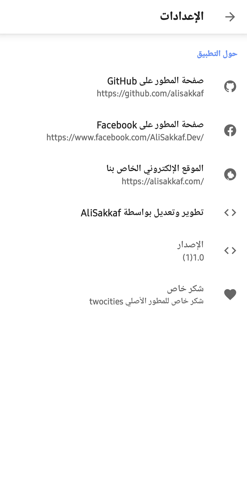
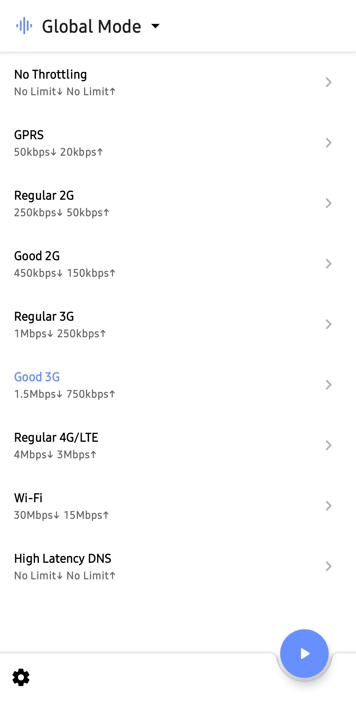
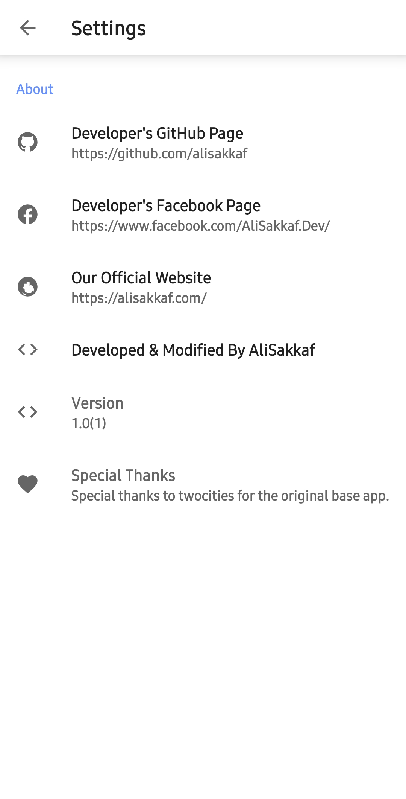
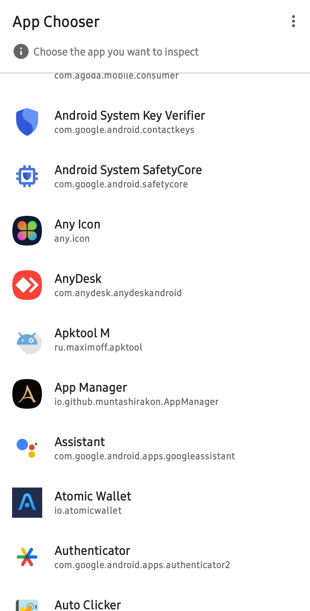

#  نت ليميتر — أداة احترافية للتحكم في سرعة الإنترنت واستهلاك البيانات للأندرويد

🌍 **[View English Version (README.md)](README.md)**

**نت ليميتر (NetLimiter)** هو تطبيق أندرويد متطور وعالي الأداء لتنظيم وتحديد سرعة شبكة الإنترنت والتحكم في النطاق الترددي (Bandwidth Control). من خلال استخدام اتصال VPN محلي آمن، يمنحك نت ليميتر القدرة على تقييد سرعات التحميل (Download) والرفع (Upload) ومراقبة استهلاك البيانات لكل تطبيق بشكل مستقل، أو للجهاز بأكمله بضغطة زر واحدة.

سواء كنت **مطوراً** بحاجة لفحص وتجربة أداء تطبيقاتك تحت ظروف اتصال شبكة ضعيفة (مثل 2G أو 3G أو تأخير استجابة DNS) أو **مستخدماً عادياً** يرغب في توفير باقة الإنترنت الثمينة ومنع التطبيقات من استهلاك البيانات في الخلفية، فإن نت ليميتر يوفر لك حلاً متكاملاً ومستقراً دون الحاجة لأي إعدادات معقدة.

---

## 📸 لقطات الشاشة

| الواجهة الرئيسية | أنماط السرعة | تحديد التطبيقات |
| :---: | :---: | :---: |
|  |  |  |

| الإعدادات | تفاصيل القييد | اختيار الوضع |
| :---: | :---: | :---: |
|  |  |  |

---

## 🌟 لماذا تطبيق نت ليميتر؟ (الهدف والغاية)

تقوم معظم التطبيقات الحديثة باستهلاك كميات هائلة من البيانات في الخلفية، مما يؤدي إلى انتهاك خصوصية المستخدم، ونفاد شحن البطارية بسرعة، واستهلاك باقة الإنترنت دون علمك. تم تطوير **نت ليميتر** لحل هذه المشكلات وإعطاء المستخدم **السيطرة الكاملة والمطلقة** على حركة مرور البيانات الخاصة بجهازه.

على عكس جدران الحماية الأخرى التي تكتفي بحظر الإنترنت أو السماح به فقط، يتميز نت ليميتر بوجود **محدد حقيقي للسرعة في الوقت الفعلي**. حيث يمكنك محاكاة الاتصالات الضعيفة، وتقييد تطبيقات الخلفية على سرعات منخفضة جداً (لمنعها من التهام البيانات مع إبقائها قيد العمل)، بالإضافة إلى إمكانية تأخير استجابة خوادم الـ DNS بشكل مصطنع لاختبار استجابة البرمجيات وتخفيف الضغط عن الشبكة.

---

## ✨ المميزات والقدرات

### 🎛️ تحكم مرن في النطاق الترددي (Bandwidth)
* **الوضع الكامل (Global Mode)**: تقييد سرعة الإنترنت للجهاز بالكامل. مفيد جداً لتوفير البيانات على مستوى النظام ومحاكاة الشبكات الضعيفة.
* **تقييد تطبيق معين (Standalone Mode)**: تقييد سرعة الإنترنت لتطبيقات محددة تختارها بنفسك، بينما تستمر بقية التطبيقات الأخرى في العمل بالسرعة الكاملة.
* **تقييد ثنائي الاتجاه**: إمكانية تحديد سرعات مستقلة لكل من **التحميل (Downlink)** و **الرفع (Uplink)** بدقة متناهية.

### 🌐 ملفات تعريفية جاهزة للسرعات الافتراضية
يضم التطبيق ملفات مسبقة الإعداد لتسهيل الاختيار السريع للسرعات المناسبة للجميع:
* **سرعة كاملة**: بدون أي قيود، يعمل بأقصى سرعة هاردوير متوفرة.
* **بطيء جداً (GPRS)**: 50 كيلوبت في الثانية تحميل / 20 كيلوبت رفع (لمحاكاة شبكات الجيل الثاني القديمة جداً).
* **بطيء (2G عادي)**: 250 كيلوبت تحميل / 50 كيلوبت رفع.
* **مقبول (2G ممتاز)**: 450 كيلوبت تحميل / 150 كيلوبت رفع.
* **متوسط (3G عادي)**: 750 كيلوبت تحميل / 250 كيلوبت رفع.
* **سريع (3G ممتاز)**: 1.5 ميجابت تحميل / 750 كيلوبت رفع.
* **سريع جداً (4G/LTE)**: 4 ميجابت تحميل / 3 ميجابت رفع.
* **شبكة لاسلكية (Wi-Fi)**: 30 ميجابت تحميل / 15 ميجابت رفع.
* **تأخير تصفح المواقع (DNS بطيء)**: لا يوجد تقييد للسرعة، ولكن يضيف تأخيراً مصطنعاً لاستجابة الـ DNS (ممتاز للمطورين لاختبار مرونة التطبيقات ضد انقطاع الشبكة).

### 🛠️ أدوات مخصصة للمطورين
* **محاكاة تأخير الـ DNS**: لمعرفة كيفية تعامل تطبيقاتك مع البطء الشديد في استجابة الخوادم.
* **عداد فوري للبيانات**: مراقبة حجم البيانات المرسلة والمستقبلة بشكل مباشر أولاً بأول.

### 🎨 تجربة مستخدم متميزة وراقية (UX)
* **تغيير لغة التطبيق بشكل مستقل**: دعم كامل للغات على مستوى نظام أندرويد 13+ (`locales_config.xml`).
* **دعم اللغتين العربية والإنجليزية**: تعريب كامل واحترافي لجميع نصوص وقوائم وواجهات البرنامج البرمجية.
* **واجهة Material Design**: ثيم داكن أنيق ومريح للعين مع أيقونات متجهة (Vector Icons) حصرية ورائعة.

---

## 🔒 حماية وخصوصية 100% (خالٍ تماماً من التتبع)

تم تجميع وبناء تطبيق نت ليميتر مع جعل **الخصوصية الأولوية القصوى**، حيث تم تجريد وإلغاء كافة خدمات التتبع والإعلانات والتحليلات التجارية تماماً:
* **حذف خدمات Google Analytics و Firebase**: إزالة مستقبلات التتبع ومهام مجدول نقل البيانات (DataTransport CCT).
* **حذف نظام الدفع وجوجل بيلينج (Play Billing)**: إزالة صلاحية الشراء `com.android.vending.BILLING` وكافة شاشات الدفع الوهمية المرتبطة بها ليكون التطبيق مجانياً بالكامل وخالياً من أي كود مدفوع.
* **اتصال محلي بالكامل**: تتم معالجة وتقييد البيانات بنسبة 100% محلياً على جهازك عبر خادم VPN افتراضي مغلق داخل بيئة الأندرويد الآمنة. بياناتك لا تغادر هاتفك أبداً ولا تتصل بأي خادم خارجي.

---

## 💻 التوافق ومتطلبات النظام

### 📱 إصدارات الأندرويد المدعومة
تم تهيئة وتطوير التطبيق ليعمل بثبات واستقرار على شريحة واسعة من إصدارات النظام:
* الحد الأدنى: **أندرويد 7.0 (Nougat, API 24)**
* الحد الأقصى: متوافق ومجرب بالكامل مع **أندرويد 14، 15، والإصدارات المستقبلية (حتى أندرويد 17 / API 35+)**

### 🧠 توافق كامل مع كافة المعالجات (CPU Architectures)
يحتوي ملف الـ APK المجمع على المكتبات البرمجية الأصلية (Native Binaries) المترجمة لجميع أنواع المعالجات العالمية:
* **arm64-v8a**: المعالجات الحديثة 64 بت (المدعومة في 99% من الهواتف الحالية).
* **armeabi-v7a**: معالجات ARM القديمة 32 بت.
* **x86**: معالجات إنتل/AMD (المستخدمة في المحاكيات).
* **x86_64**: معالجات إنتل 64 بت للمحاكيات عالية الأداء.

هذا يضمن تشغيل التطبيق بكفاءة كاملة على جميع الهواتف والأجهزة اللوحية، وصناديق التلفزيون الذكية (Android TV Boxes)، بالإضافة إلى محاكيات الكمبيوتر (مثل BlueStacks, LDPlayer, Nox, ومحاكي Android Studio الرسمي).

---

## 🚀 طريقة التثبيت

1. قم بتحميل ملف الـ APK المجمع مباشرة من **[رابط ميديا فاير](https://www.mediafire.com/file/qwt3c31mtkwfxi7/NetLimiter_By_AliSakkaf.apk/file)** أو من خلال قسم **Releases** في GitHub.
2. انتقل إلى إعدادات الأمان في هاتفك وقم بتفعيل خيار **"تثبيت التطبيقات من مصادر غير معروفة"**.
3. قم بتثبيت ملف الـ APK وتشغيل برنامج **نت ليميتر**.
4. اختر النمط المناسب وقم بتشغيل المفتاح الرئيسي للبرنامج!

---

## ⭐ ادعم المستودع بنجمة!

إذا أعجبك هذا المشروع وساعدك في عملك، يرجى **منح المستودع نجمة (⭐ Star)** على جيت هاب! دعمك يساهم في زيادة انتشار المشروع ووصوله للمطورين والمهتمين.

---

## 👨‍💻 الفضل البرمجي والتقدير

* تم تعديل العلامة التجارية، تعريب التطبيق، وتحسينه بواسطة **[AliSakkaf](https://github.com/alisakkaf)**.
* شكر خاص للمطور الأصلي **twocities** على تطويره لأساس هذا البرنامج.
